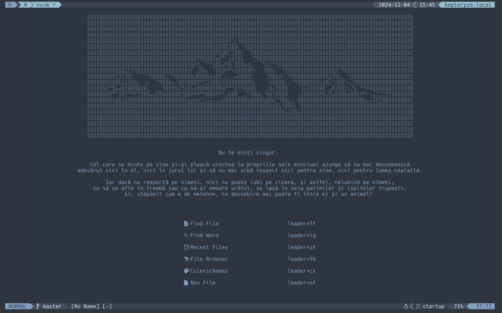
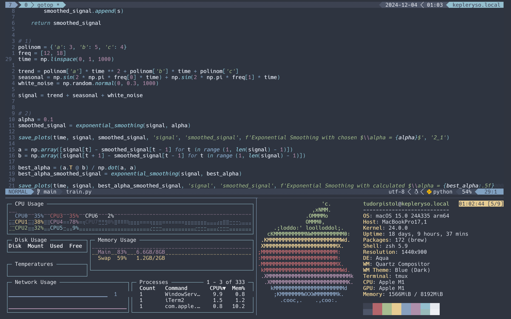

# nvim-config

This is my Neovim configuration, created using various tutorials.

Here are a few screenshots below:

## Useful Links
- [Neovim Official Website](https://neovim.io/)
- [Awesome Neovim](https://github.com/rockerBOO/awesome-neovim)
- [Neovim for Newbs. FREE NEOVIM COURSE](https://youtube.com/playlist?list=PLsz00TDipIffreIaUNk64KxTIkQaGguqn&si=DjTU1Kw8ugcbn3Xm)
- [ThePrimeagen](https://www.youtube.com/@ThePrimeagen)
- [Josean Configuration](https://github.com/josean-dev/dev-environment-files.git)
